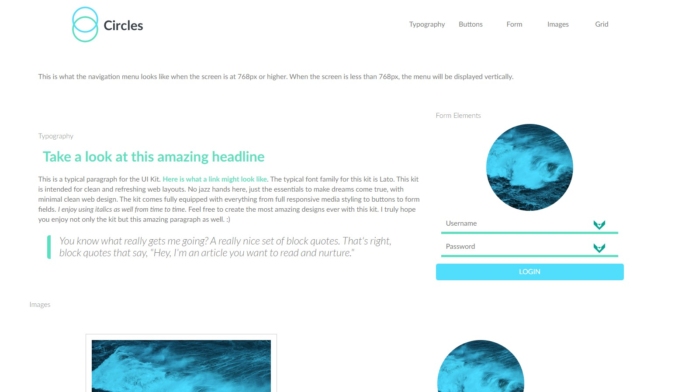

# Teachdegree-project 4
> A mobile-friendly Web Style Guide, written in SASS using partial files.

## Table of contents
* [General info](#general-info)
* [Screenshots](#screenshots)
* [Technologies](#technologies)
* [Features](#features)
* [Contact](#contact)

## General info
The fourth project that I have built as a web style guide. it uses powerful mixins are variables allowing you to change styles with just a few tweaks.

## Screenshots

## Technologies
* CSS3
* HTML5

## Features
List of features ready and TODOs for future development
* Fully converted SASS
* Powerfully mixins
* All colors and styles stored variables

## Contact
Created by [@JordanBurch101](https://github.com/Jordanburch101) - feel free to contact me!